# Predicting Fentanyl Involvement in Connecticut Overdose Deaths

## Overview
An end to end analysis of drug overdose deaths in Connecticut from 2012 through 2018, combining exploratory data analysis of demographic, temporal, and geographic patterns with a Random Forest classifier built to predict whether fentanyl was present in a fatal overdose.

Completed as the capstone project for ALY 6140 at Northeastern University.

## Motivation
Living in Seattle and seeing open drug use firsthand motivated a closer look at the patterns behind the overdose crisis. Having come from Asia, where public drug use is far less visible, the scale of the issue stood out immediately. This project examines demographic risk factors including sex, race, and age to identify which groups face the greatest risk of fatal overdose.

## Dataset
Drug overdose death records from Kaggle covering Connecticut, with 42 columns and 5,105 rows.

Key variables used:

| Column | Description |
|---|---|
| `Date` | Date of death, parsed to extract `Year` |
| `Age` | Age of the individual |
| `Sex` | Sex of the individual |
| `Race` | Race of the individual |
| `DeathCounty` | County where the death occurred |
| `COD` | Cause of death, including single or multiple drug types |
| `Heroin` | Binary flag, 1 if detected in toxicology, 0 if not |
| `Cocaine` | Binary flag, 1 if detected, 0 if not |
| `Fentanyl` | Binary flag, 1 if detected, 0 if not. Target variable for the model |

## Exploratory Findings

### 1. Overdose deaths skew heavily male, white, and middle aged
The age distribution peaks between roughly 25 and 60, with males accounting for close to three times the number of deaths as females. White individuals make up the overwhelming majority of records.

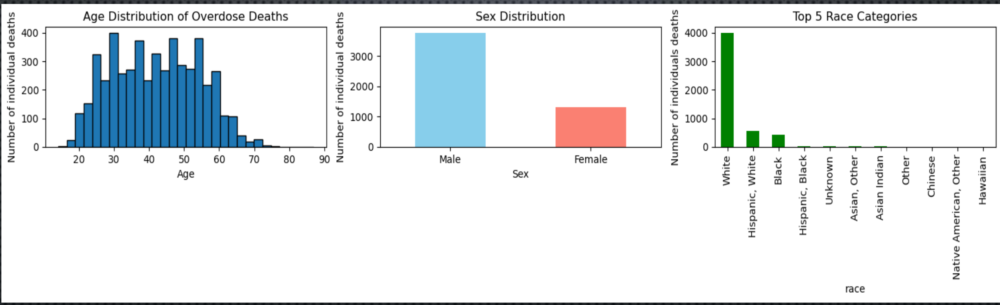

Important context for interpreting these counts: Connecticut's population over this period was roughly 3,590,000 and approximately 71 to 73 percent white, with a near even sex split at 49 percent male and 51 percent female. The racial skew in the data therefore partly reflects the state's underlying demographics, while the male skew does not and represents a genuine risk differential.

### 2. Heroin and fentanyl dominate fatal overdoses, cocaine trails
Across all records, heroin was detected in 49.5 percent of cases and fentanyl in 43.7 percent, while cocaine appeared in 29.8 percent. Percentages exceed 100 in total because multiple substances are frequently detected in the same individual.

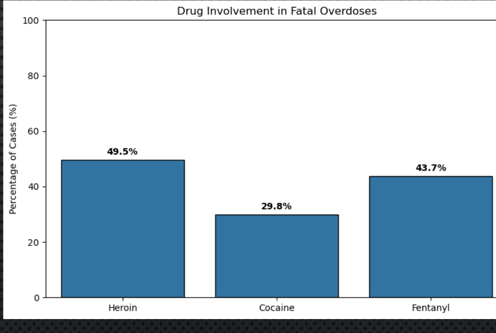

### 3. Fentanyl overtook heroin in 2016 and kept climbing
Plotting yearly detection rates reveals the central story of the dataset. Fentanyl started near 4 percent in 2012 and rose steeply, crossing heroin in 2016 and reaching roughly 74 percent by 2018. Heroin peaked around 58 percent in 2014 before declining to 38 percent, while cocaine held relatively flat in the 23 to 34 percent range throughout.

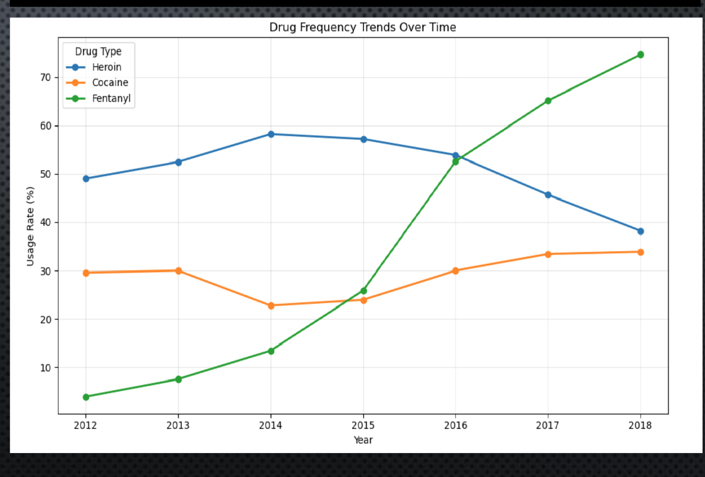

### 4. The three substances show essentially no pairwise correlation
A co-occurrence correlation matrix returned values near zero across all pairs: heroin and cocaine at -0.00, fentanyl and heroin at -0.04, and fentanyl and cocaine at 0.03. In practical terms, detecting one of these substances tells you almost nothing about whether another was also present.

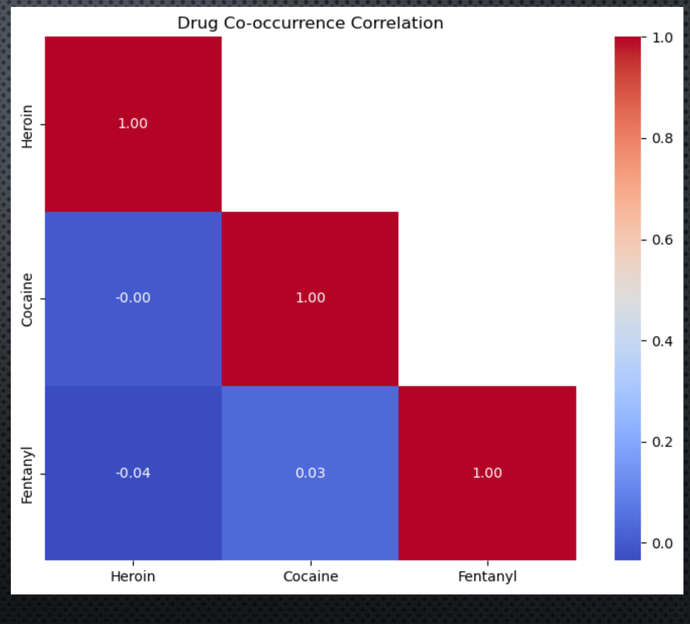

### 5. Deaths concentrate in Hartford and New Haven, but fentanyl rates are high statewide
Hartford recorded the most overdose deaths at 1,233, followed by New Haven at 1,107 and Fairfield at 623. Tolland recorded the fewest at 113.

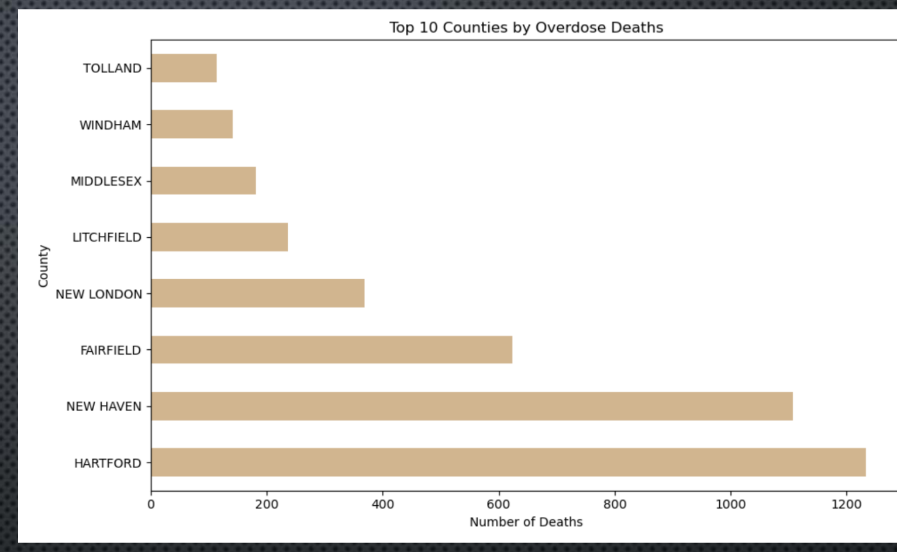

Fentanyl involvement does not track county size. Tolland, the smallest county by death count, had the highest fentanyl rate at 51.3 percent, while New Haven, the second largest, had the lowest at 35.9 percent. Cocaine had the lowest rate in every county without exception.

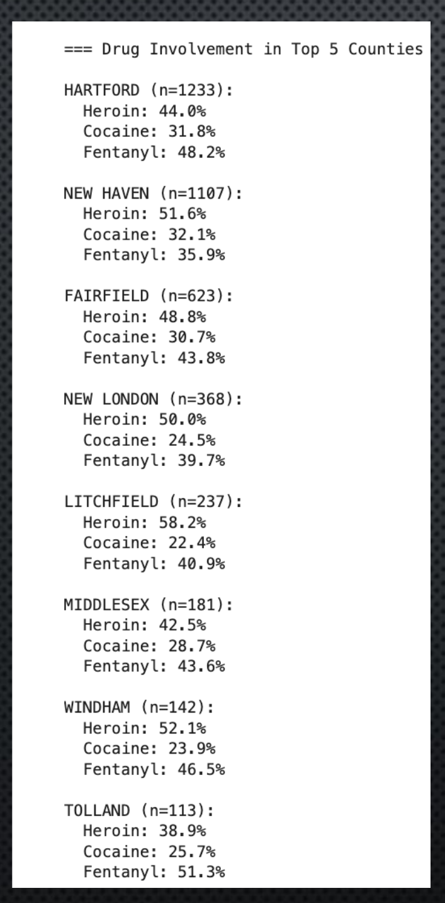

## Predictive Model: Random Forest

**Target:** `Fentanyl` (1 = present, 0 = not present)

**Features:** Year, Age, Race, Sex, DeathCounty, Cocaine, Heroin

**Preprocessing:** Categorical features (Sex, Race, DeathCounty) were text strings and were one hot encoded into binary columns, producing 2 columns for sex, 10 for race, and 8 for death county.

**Configuration:** `RandomForestClassifier` with 100 trees, `max_depth=10`, `min_samples_split=10`, and `class_weight='balanced'` to handle class imbalance. Data split 80 percent training (4,084 samples) and 20 percent test (1,021 samples), stratified on the target to preserve class balance across both sets.

### Results

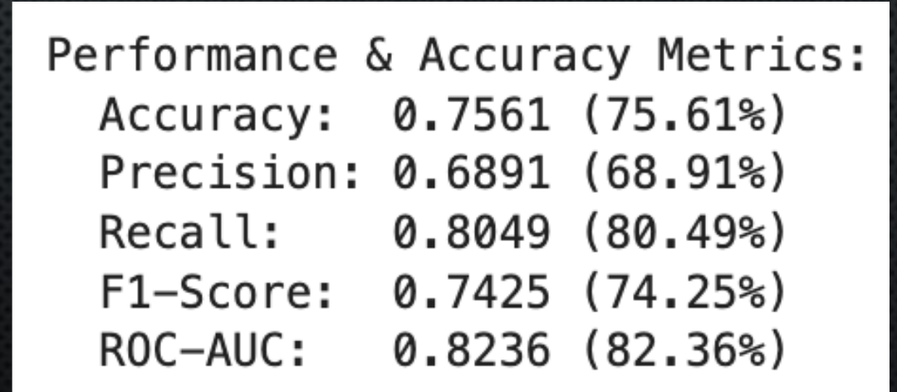

The model reached 75.61 percent accuracy with a ROC AUC of 82.36 percent, well above the 50 percent baseline of a random classifier. Recall at 80.49 percent notably outpaced precision at 68.91 percent, meaning the model catches most true fentanyl cases but over predicts them, an acceptable tradeoff for a public health screening context where missing a case is costlier than a false alarm.

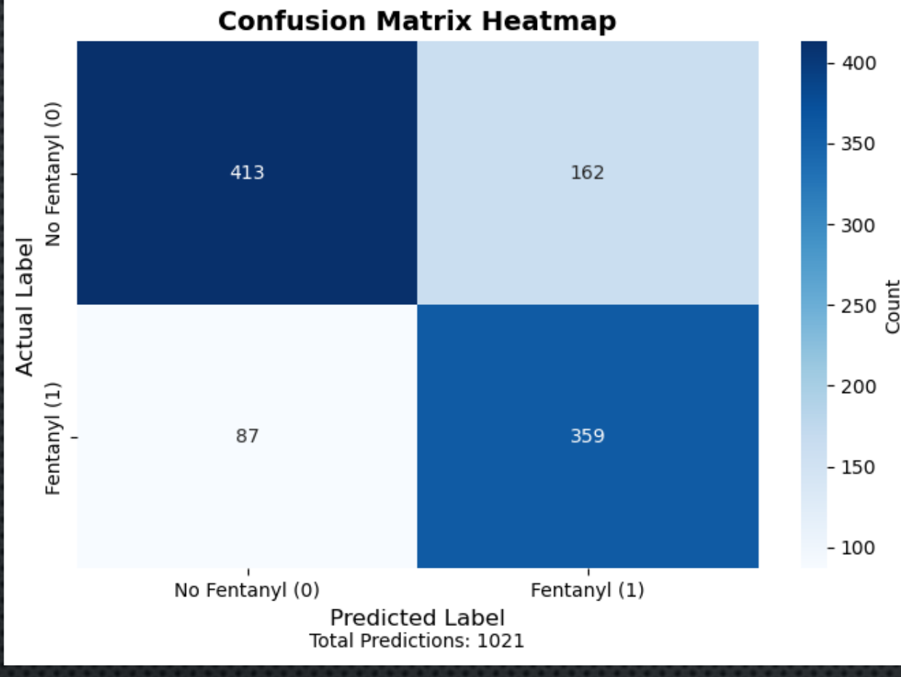
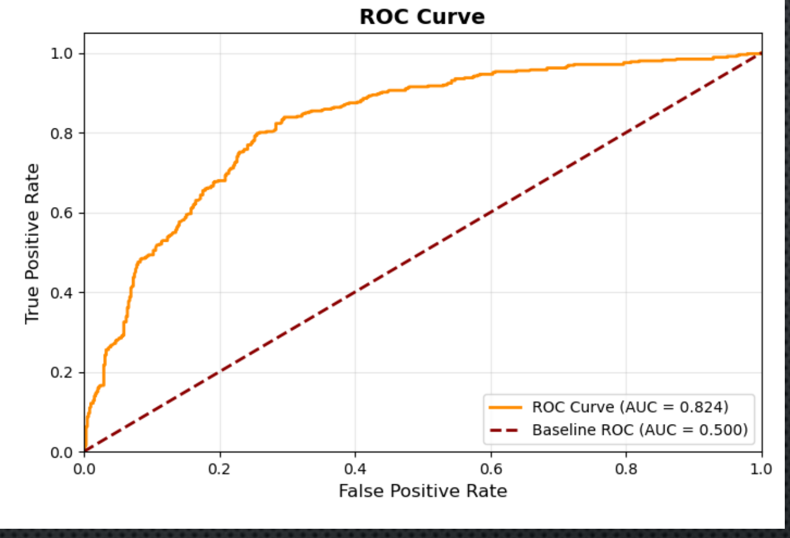

Out of 1,021 test predictions, the model correctly identified 359 fentanyl cases and 413 non fentanyl cases, with 162 false positives and 87 false negatives.

### Feature Importance
Year overwhelmingly dominates as a predictor at 0.654, followed by age at 0.159. Every remaining feature contributes less than 0.04 individually.

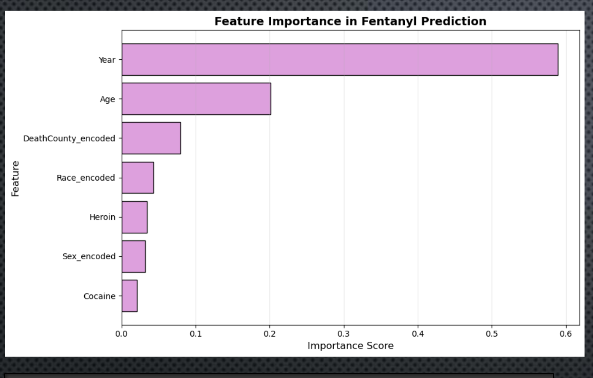
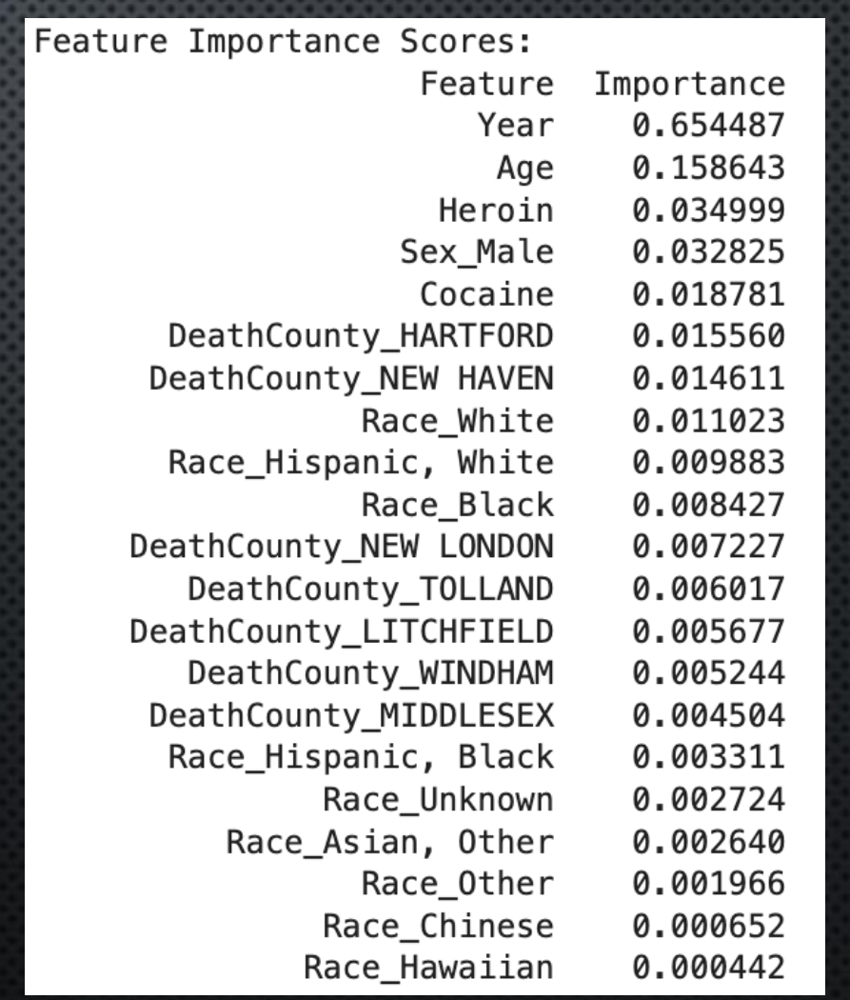

This confirms the trend seen in the exploratory analysis: the single best signal for whether fentanyl was present is simply what year the death occurred. Race features cluster at the bottom, likely a consequence of limited racial diversity in the underlying Connecticut population rather than an absence of any real relationship.

## Conclusion
Fentanyl involvement in Connecticut overdose deaths can be predicted with reasonable accuracy using demographic, temporal, and drug interaction features. The dominance of year as a predictor confirms fentanyl's dramatic emergence over the study period rather than pointing to a stable demographic profile of risk.

These findings suggest intervention strategies should prioritize fentanyl and heroin users and target specific age groups and geographic hotspots. The presence of both false negatives and false positives highlights the need for continued model refinement alongside harm reduction approaches such as widespread fentanyl test strip distribution, particularly in high risk counties.

## Methods and Tools
Analysis performed in **Python** using `pandas`, `numpy`, `matplotlib`, `seaborn`, and `scikit-learn`.

Techniques applied:
- Data cleaning of inconsistent `Fentanyl` entries (values such as `1-A`, `1 POPS`, and `1 (PTCH)` mapped to 1) followed by type casting to integer
- Datetime parsing with `pd.to_datetime(format='mixed')` to extract year from mixed format date strings
- Distribution analysis across age, sex, and race using multi panel matplotlib subplots
- Pairwise correlation analysis with a masked upper triangle heatmap via `np.triu` and `sns.heatmap`
- Grouped aggregation with `groupby().mean()` to derive yearly detection rates and county level involvement rates
- One hot encoding of categorical features for model input
- Stratified train test split to preserve class balance
- Random Forest classification with balanced class weights
- Model evaluation via accuracy, precision, recall, F1, ROC AUC, confusion matrix, and feature importance analysis

## Reference
Drug overdose deaths. (n.d.). Kaggle. https://www.kaggle.com/datasets/ruchi798/drug-overdose-deaths
